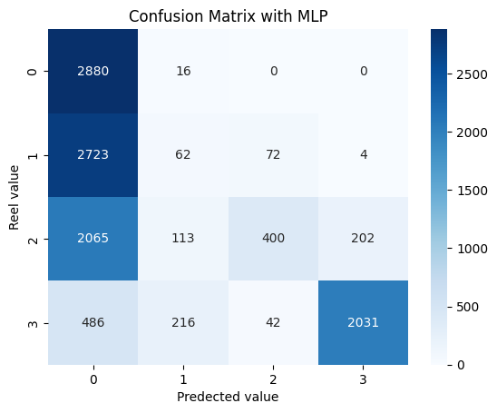

# Project: Modeling Water Quality Index using Deep Learning, Machine Learning, and Statistical Algorithms
## Overview
This is a master's thesis project focused on modeling the Water Quality Index (WQI) using various data science techniques, including deep learning, machine learning, and statistical algorithms. The project utilizes two datasets: one from India and another from Hong Kong. The Indian dataset is used for comparison with existing literature, while the Hong Kong dataset is used for forecasting using CNN, LSTM, and ARIMA models.

## Contents
- Problem Statement
- Dataset Description
- Approach
- Data Preprocessing
- Modeling Techniques
- Evaluation Metrics
- Results and Analysis
- Conclusion
- Future Work
- References
## roblem Statement
The main objective of this project is to develop accurate models for predicting the Water Quality Index (WQI) based on various water quality parameters. The models should be capable of forecasting the WQI values accurately, which can be crucial for water quality management and environmental monitoring.

## Dataset Description
Indian Dataset: Contains water quality data from various locations in India. This dataset is used for comparing the model's performance with existing literature.
Hong Kong Dataset: Consists of water quality data from different monitoring stations in Hong Kong. This dataset is utilized for forecasting WQI values using CNN, LSTM, and ARIMA models.
## Approach
- Data Preprocessing: Cleaning the datasets, handling missing values, and performing feature engineering.
- Modeling Techniques: Implementing deep learning (CNN, LSTM), machine learning (Random Forest, Gradient Boosting), and statistical (ARIMA) models for WQI prediction.
- Evaluation Metrics: Using appropriate metrics such as RMSE, MAE, and R-squared to evaluate model performance.

## Introduction
Water serves as a vital resource for nearly every kind
of life on Earth. It is crucial in sustaining ecosystems,
supporting agriculture, providing drinking water,
and aiding multiple industries. However, water
quality is crucial for ensuring its usefulness for these
applications. Water quality refers to the physical,
chemical, and biological properties of water that
influence its general health and suitability for certain
uses.
It’s nearly difficult to understate the value of water
quality. Clean and appropriate water is vital to
human health and health. Contaminated water may
danger human populations by producing illnesses
linked to water and other medical issues. Also, water
pollution can have a detrimental effect on aquatic
ecosystems, causing biodiversity loss and disruption
of ecological balance.
# Our methodology Deep Learning
The process used for this research is illustrated in Figure 1. Water data from some historical Water Control
Zone in Hong Kong was acquired and pre-processed
using Z-score normalization in SMOTE to address
the class imbalance in the original dataset. Traditional deep learning techniques like CNN and MLP
are evaluated for predicting water quality (WQC).
The work proposed in this review includes machine
learning algorithms. To extend the research, a small
amount of data was generated to determine the possibility of using deep learning algorithms such as
CNN, and LSTM, as well as statistical algorithms
such as ARIMA, in WQI forecasting. In general, this
research includes data processing, the application
of deep learning and statistical algorithms, analysis
using several metrics, and comparison of results to
better understand predictions of WQC and forecasts
of WQI.
# Dataset collection
The dataset for this study has been collected from
historical Water Control Zones in Hong Kong. It
contains 32,528 samples taken from various rivers in
Hong Kong between 1986 and 2020. Water clarity,
dissolved oxygen, oxygen demand, nutrients, and bacteria are among the parameters obtained.
This information was gathered as part of the
Hong Kong Environmental Protection Department’s
(EPD) monitoring operations. These metrics
were measured at 48 separate research stations
in the dataset. This dataset, which contains information about the river’s water quality, may
be found at https://www.kaggle.com/datasets/
chikity/hkriverhistorical1986-2020. The Hong
Kong Environmental Protection Department issued
it.
We just used this dataset for classification purposes.
However, for time series forecasting, we hired a smart
data strategy to focus on a specific subset of data. We
selected the triple combination zone, river, station
= Junk Bay, Tseng Lan Shue Stream, JR11 because
comprehensive Water Quality Index (WQI) data was
available from 1986 to 2020.

# Data splitting
Splitting data is a crucial step in machine learning
and deep learning methodologies. It divides the
dataset into two sets. In classification tasks, the
dataset is divided into a training set (80% of the
data) and a test set (the remaining 20%). The model’s
performance and its ability to generalize to previously unknown data can be evaluated through this
divide.
When forecasting activities, a different technique is
used. The dataset is divided into two parts: a training set and a test set, with the test set containing
only the latest four years, from 2016 to 2020. The
remaining data is included in the training set. This
division is based on the forecasting aim of evaluating
the model’s errors in predicting future data.
We can successfully assess the model’s performance
in both classification and forecasting tasks by using
these appropriate data-splitting procedures, verifying its capacity to handle unseen data and produce
valid predictions.

# Water Quality Index Calculation (WQI)
The Hong Kong EPD describes their own WQI calculation based on three of the 48 parameters: dissolved
oxygen, biological oxygen content, and ammonianitrogen. To indicate the purity of water, the international standard of IQE usually employs at least 5 to
6 separate metrics. Because EPD currently gathers
such water quality data, I opted to employ the international convention, which should provide a comprehensive description of water quality. The method
used to calculate the WQI in the Water Atlas differs slightly from the DEP method in that it does
not incorporate the various biodiversity data (eg -d.
macroinvertebrate indices). Chapter 2 is a description of the technique employed by the Florida Department of Environmental Protection.[1] The WQI is
computed by averaging the individual index values
of some or all of the parameters within five water
quality parameter categories [2]:
• Water Clarity: Turbidity (NTU*) and/or Secchi
Disc Depth (meters or feet);
• Dissolved oxygen: dissolved oxygen (mg/l);
• Oxygen demand: biochemical oxygen demand (mg/l), chemical oxygen demand (mg/l),
and/or total organic carbon (mg/l);
• Nutrient: total nitrogen (mg/l), and/or total
phosphorus (mg/l);
• Bacteria: total coliforms ( per mg/l) and/or fecal
coliforms (per mg/l)
The water quality index evaluates the overall quality
of water in an area using a variety of factors. A
"confidence value" ranging from 1 to 5 indicates the
number of categories examined in computing the
index. If some data is missing, the index calculation
may not include all categories[3].
# Water Quality Index Calculation and Data Preprocessing

## Overview

This repository provides information on the calculation of the Water Quality Index (WQI) based on various parameters such as total nitrogen, total phosphorus, total coliforms, and fecal coliforms in water samples. The WQI is a comprehensive measure that evaluates the overall quality of water in a given area.

## Water Quality Index (WQI) Classification

The WQI is classified into different categories to represent varying levels of water quality:

| WQI Range | Classification        |
|------------|------------------------|
| 0-25       | Excellent              |
| 26-50      | Good                   |
| 51-75      | Poor                   |
| 76-100     | Very Poor              |
| Above 100  | Unsuitable for Drinking|

## Confidence Value

The confidence value, ranging from 1 to 5, indicates the number of categories examined in computing the WQI. If some data is missing, the index calculation may not include all categories.

## Data Preprocessing

To ensure the accuracy, reliability, and relevance of the data used in WQI calculation, a thorough data preprocessing phase is crucial. The following steps are involved:

### Data Cleaning

Clean the collected data to remove inconsistencies, errors, or missing values. This step includes identifying and correcting data entry errors, handling outliers, and managing missing data by appropriate methods such as replacing missing values with the mean value of each station.

### Data Normalization

Normalize the data using the Standard scaling technique, which scales all values around the mean with a unit standard deviation. The standard scaling formula is:

Where:
- `µ` represents the mean
- `σ` represents the standard deviation
- `Z` is the scaled (normalized) value
- `x` represents the value of a particular sample

# Balancing classes : 
The synthetic minority oversampling technique method is a class imbalance
oversampling strategy. It uses a portion of data
from minority classes to produce similar new
synthetic instances. After that, the synthetic
instances are added to the original data set.
SMOTE creates a sample from the line between
the minority class samples and their neighbors
in this technique. The added dataset can be
used to train the classification model, overcoming the overfitting due to simple random oversampling[6]. Figure 3 illustrates a schematic diagram of the synthetic instances of the SMOTE
method.

# Results
Each confusion matrix describes how a classification
model works on a set of test data whose actual values
are well-known. The confusion matrix was used to
compute the parameters illustrated in Figure 6.

## Performance of Machine Learning Models

The table below presents the performance metrics of various deep and machine learning models in predicting WQC:

| Algorithm       | Accuracy | Precision | Recall | F1-score |
|-----------------|----------|-----------|--------|----------|
| CNN             | 0.97     | 0.97      | 0.97   | 0.97     |
| MLP             | 0.48     | 0.73      | 0.48   | 0.42     |
| Random Forest   | 0.98     | 0.98      | 0.98   | 0.98     |
| SVM             | 0.50     | 0.51      | 0.50   | 0.46     |
| KNN             | 0.85     | 0.85      | 0.85   | 0.85     |
| Decision Tree   | 0.95     | 0.95      | 0.95   | 0.95     |
| XGBoost         | 0.99     | 0.99      | 0.99   | 0.99     |

# Forcasting water quality index
## Performance Assessment of Algorithms

The table below presents the performance metrics of various algorithms in predicting Water Quality Classification (WQC):

| Algorithm       | MSE     | MAE     | RMSE    | RMAE    | MAPE    | R2      |
|-----------------|---------|---------|---------|---------|---------|---------|
| CNN             | 42.2509 | 5.0322  | 6.5     | 2.2432  | 14.5680 | 0.2394  |
| LSTM            | 46.4799 | 5.5027  | 6.8176  | 2.3457  | 15.6413 | 0.05814 |
| ARIMA           | 31.5296 | 4.7823  | 5.6151  | 2.1868  | 13.1955 | 0.2226  |

# Forecasting WQI for four years ahead
To forecast the Water Quality Index (WQI) four years
in advance, forecasting models must be trained on
the complete dataset using a consistent architecture.
For this purpose, various algorithms such as ARIMA,
LSTM, and CNN can be applied.
At last, so as to forecast the WQI four years in advance, ARIMA, LSTM, and CNN models have to be
trained on the whole data set using a consistent architecture. When properly trained, these models can
provide reliable predictions and insights on future
WQI advances.

## License

Ce projet est sous la licence [MIT](https://choosealicense.com/licenses/mit/).

## How to Use
Clone or download the project repository.
Install the required dependencies (Python libraries, frameworks).
Follow the step-by-step guide provided in each section of the project.
Utilize the provided datasets to replicate the experiments and analyses.
Customize and modify the project as needed for further research or applications.

## Remarques

Si vous rencontrez des problèmes ou avez des questions concernant le projet, n'hésitez pas à créer une nouvelle issue ou à me contacter.

## Auteurs

- OUAKIB Amine - [@amineouakib](https://github.com/amineouakib)

---
**Note:** Vous pouvez personnaliser le contenu du fichier `README.md` en ajoutant plus d'informations sur votre projet, les instructions d'installation, la configuration de l'environnement, etc.

